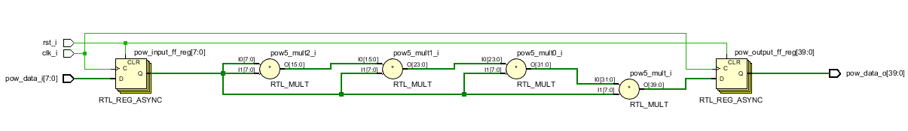
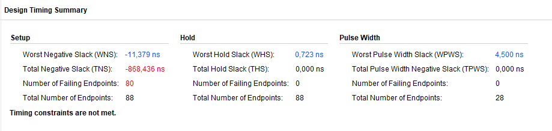
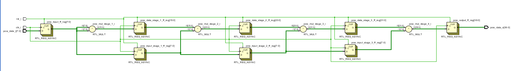
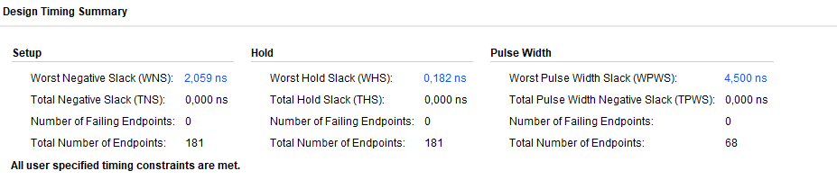

# Отчет по Лабораторной работе 5. Конвейеры и систолические массивы
### 5.1 Сделайте сравнительный анализ тактовой частоты примера без конвейеризации и примера с конвейеризацией. Какой из примеров быстрее, почему?

Используемый файл XDC в проекте:

```verilog
create_clock -period 10.000 -name clk_i -waveform {0.000 5.000} -add [get_ports clk_i]
```
RTL примера без конвейеризации:

<p align="center" > </p>

Результат имплементации примера без конвейеризации:

<p align="center" > </p>

RTL примера без конвейеризации:

<p align="center" > </p>

Результат имплементации примера c конвейеризации:

<p align="center" > </p>

### 5.2 Добавьте clock gating для регистров с данными в пример исходного кода по ссылке. Напишите тестбенч и убедитесь в том, что дизайн работает корректно после правок.

### 5.3 Уберите лишние ресеты в примере исходного кода по ссылке. Напишите тестбенч и убедитесь в том, что дизайн работает корректно после правок.

### 5.4 Откройте файл по ссылке. В этом файле находится пример систолического массива размером 2x2. Увеличьте размер массива до 2x3 (2 в высоту, 3 в ширину, как в рассмотренных примерах), добавив ещё два узла. Напишите тестбенч и убедитесь в том, что дизайн работает корректно после правок.
